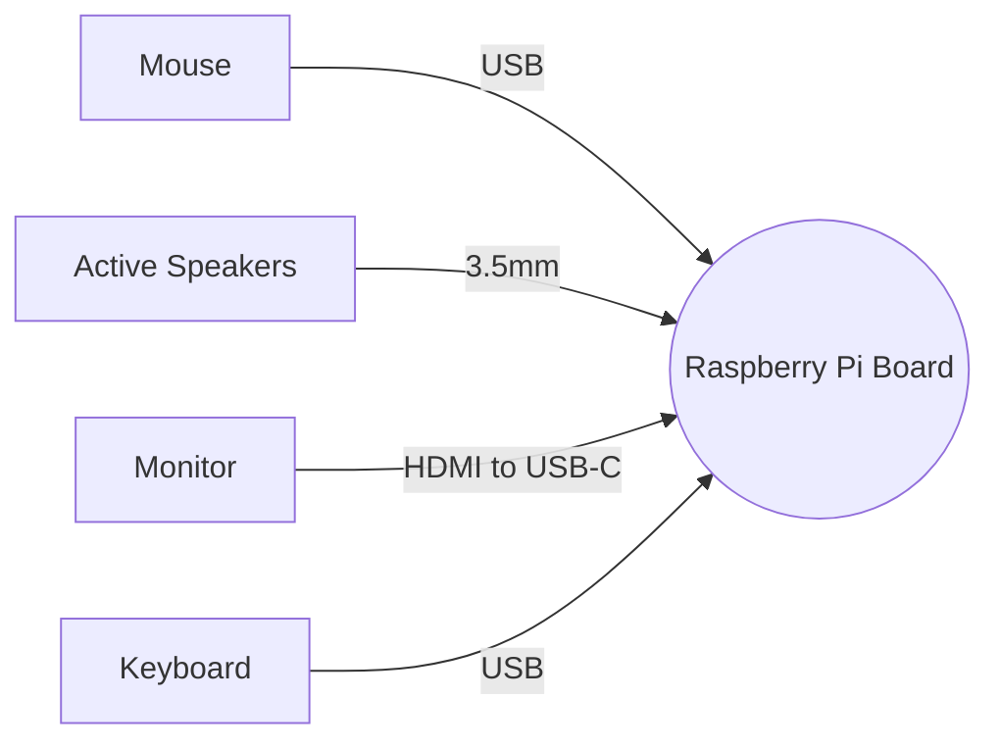
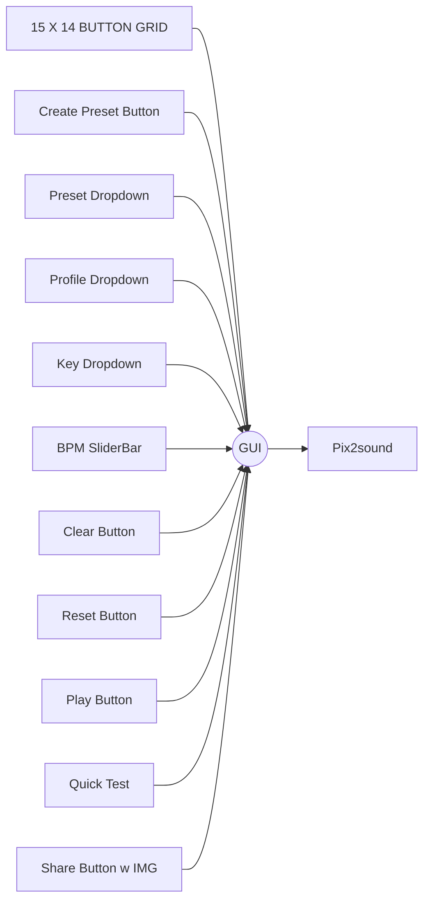

# EGL314 WART Group D // Andy,Bryan

###	Table of content

1. Equipment List
2.	Software list
3.	Using Tkinter for the GUI
4.	Install sound library and modules
5.	Setting up variables and list(Of list)
6.	Make a grid of buttons (15x14)
7.	Toggle buttons between 1 and 0 (With colour change)
8.	Dropdown & slider for notes, type and BPM selection
9. Play, clear and reset buttons
10. Quick Test
11. Presets
12. Create own presets
13. Screenshot, Share Button w an Image
14. Final GUI look

### Equipment List	


###	Software List


### Using Tkinter for the GUI
First thing to do is to import Python GUI Tkinter module:
```python
from tkinter import *
```
Along with other modules required for this GUI.
```python
from tkinter import messagebox
import tkinter.font as font
import pyautogui
from PIL import Image, ImageTk
import time
import yagmail
import json
```
>Note: (*) refers to all variables, methods, etc.
### Install sound library and modules

Install sound library [here](https://github.com/sambalchicken/sorpiart-WART/blob/main/pix2music.py).

Import sound library module:
```python
from pix2music.py import *
```
>Note: Ensure file is in same folder directory as GUI.

Installation of all modules mentioned above:
1. Open Terminal
2. Type these commands (use "pip3" instead for python3)
 
- `sudo apt install sox`
-  `pip install pillow`
- `pip install pyautogui`
- `pip install yagmail`

After the installation, it is ready to start creating the GUI.

To create a window, along with title and size:
```python
main=Tk()
main.title("Musical GUI")
main.minsize(1200, 1000)
main.maxsize(1200, 1000)
```
>Using minsize and maxsize to ensure a constant size.

Add a loop at the end:
`main.mainloop()`
>To run application forever, as long as the window is not closed.
>>Note: The loop should be placed at the **last** line !
### Setting up variables and list (of lists)
box and mainbox shall be used for **columns** and **rows** respectively:
```python
box = [0 for j in range(14)] #list with 14 zeros
mainbox = [i for i in range(15)] #list with 15 items
button = [i for i in range(15)] #list with 15 items
for i in range(15):  #turn every item into "box"
    mainbox[i] = [0 for j in range(14)]
    button[i] = [0 for j in range(14)]  
```
Output for each line of code above if printed:
```python
Output:
box = [0,0,0,0,0,0,0,0,0,0,0,0,0,0]
-
mainbox = [0,1,2,3,4,5,6,7,8,9,10,11,12,13,14]
button = [0,1,2,3,4,5,6,7,8,9,10,11,12,13,14]
-
mainbox = [[0,0,0,0,0,0,0,0,0,0,0,0,0,0],[0,0,0,0,0,0,0,0,0,0,0,0,0,0],[0,0,0,0,0,0,0,0,0,0,0,0,0,0],
...]
mainbox = [[0,0,0,0,0,0,0,0,0,0,0,0,0,0],[0,0,0,0,0,0,0,0,0,0,0,0,0,0],[0,0,0,0,0,0,0,0,0,0,0,0,0,0],
...]
```
>The mainbox contains 15 of box : "[0,0,0,0,0,0,0,0,0,0,0,0,0,0]" in its list.

### Make a grid of buttons (15x14)
Create 14 columns and 15 rows of buttons:
```python
for i in range(15):
    for j in range(14):
        button[i][j] = Button(main, text='{}'.format(notes[j]),width=5, height=3,font=myFont)
        button[i][j].grid(row=i, column=j)
        button[i][j].config(activebackground='white', bg='white',command=lambda send_var=(i,j):func(send_var))
```
>Command to **toggle** buttons whenever clicked.
>>Also, a **grid** layout is mainly used in this GUI.

It should look like this:


### Toggle buttons between 1 and 0 (with colour change):
```python
def func(get_var):  
    
    if mainbox[get_var[0]][get_var[1]] == 0:
        mainbox[get_var[0]][get_var[1]] = 1 
        button[get_var[0]][get_var[1]].config(activebackground="green",bg='green')
        #change toggle status from 0 to 1
    else:  
        mainbox[get_var[0]][get_var[1]] = 0
        button[get_var[0]][get_var[1]].config(activebackground="white",bg='white')
        #change toggle status from 1 to 0
                     
```
> "mainbox[get_var[0]][get_var[1]]" gets row and column of mainbox, if it's 1, make it 0 and vice versa, (default is 0).

### Dropdown & slider for notes, type and BPM selection
---
- Dropmenus, and set default values for profiles and keys.
- Store input in a variable for pix2music sound library later.
- OptionMenu's syntax: OptionMenu(master, variable,*values)
  - master is the window to place the widget in.
  - variable means it is not fixed, types like String() and Int() can be implemented.
  - *values is the name of list to store all the options.
```python
profiles = ['pluck', 'sine', 'square', 'triangle', 'sawtooth', 'trapezium']
profilesInsert = StringVar()
profilesInsert.set("sine")
profileDropdown = OptionMenu(main, profilesInsert, *profiles)
profileDropdown.place(x= 1050, y=200)
profileLabel = Label(main, text='Select Profile:',font=myFont)
profileLabel.place(x=1055, y=175)
profileDropdown.config(width=8, height=2,bg='white',activebackground='white')

key = ['C1', 'C2', 'C3', 'C4', 'C5', 'C6']
keyInsert = StringVar()
keyInsert.set("C4")
keyDropdown = OptionMenu(main, keyInsert, *key)
keyDropdown.place(x=1050, y=300)
keyLabel = Label(main, text='Select Key:',font=myFont)
keyLabel.place(x=1058, y=275)
keyDropdown.config(width=8, height=2,bg='white',activebackground='white')

BPM = IntVar()
BPM.set(60)
BPMScale = Scale(main, variable=BPM, from_=60, to=180, orient=HORIZONTAL)
BPMScale.config(activebackground='white',bg='white')
BPMScale.place(x=1055,y=400)
BPMLabel = Label(main, text='BPM(60-180)',font=myFont)
BPMLabel.place(x=1055, y=375)
BPMLabel.config(activebackground='white')
```
>The profiles, keys and BPM are to be stored in **variables** for implementation of sound library.
>>Both key and profile are **strings** type while BPM is suppose to be an **integer** type. Hence, the StringVar() and IntVar(). 

### Play, clear and reset buttons
A play button is needed to eventually send out **selected** buttons. Clear and reset buttons were also added.

```python
playbutton = Button(main,bg='white',activebackground='white', text="Play Sound", font=myFont,padx=10, pady=20, command=print_toggle, relief='ridge').place(x=1050, y=600)
clearbutton = Button(main,bg='white',activebackground='white', text="Clear", padx=30, pady=10, command=clearbtn, relief='ridge',font=myFont).place(x=1050, y=480)
resetbutton = Button(main,bg='white',activebackground='white', text="Reset", padx=30, pady=10, command=resetbtn, relief='ridge',font=myFont).place(x=1050, y=540)
```
Each button comes with their **own** functions:
```python
def empty():
    messagebox.showinfo(title='Error', message='No notes selected!')
    
def print_toggle():
    if mainbox == [[0, 0, 0, 0, 0, 0, 0, 0,0, 0, 0, 0, 0, 0], [0, 0, 0, 0, 0, 0, 0, 0,0, 0, 0, 0, 0, 0], [0, 0, 0, 0, 0, 0, 0, 0,0, 0, 0, 0, 0, 0], [0, 0, 0, 0, 0, 0, 0, 0,0, 0, 0, 0, 0, 0], [0, 0, 0, 0, 0, 0, 0, 0,0, 0, 0, 0, 0, 0], [0, 0, 0, 0, 0, 0, 0, 0,0, 0, 0, 0, 0, 0], [0, 0, 0, 0, 0, 0, 0, 0,0, 0, 0, 0, 0, 0], [0, 0, 0, 0, 0, 0, 0, 0,0, 0, 0, 0, 0, 0], [0, 0, 0, 0, 0, 0, 0, 0,0, 0, 0, 0, 0, 0], [0, 0, 0, 0, 0, 0, 0, 0,0, 0, 0, 0, 0, 0], [0, 0, 0, 0, 0, 0, 0, 0,0, 0, 0, 0, 0, 0], [0, 0, 0, 0, 0, 0, 0, 0,0, 0, 0, 0, 0, 0], [0, 0, 0, 0, 0, 0, 0, 0,0, 0, 0, 0, 0, 0], [0, 0, 0, 0, 0, 0, 0, 0,0, 0, 0, 0, 0, 0], [0, 0, 0, 0, 0, 0, 0, 0,0, 0, 0, 0, 0, 0]]:
        empty()
        resetbtn()
    else:
        pix2music(profilesInsert.get(),BPM.get(),keyInsert.get(),mainbox) 
    
def clearbtn():
    for i in range(15):
        mainbox[i] = [box[j] for j in range(14)]
    btngreen()
    
def resetbtn():
    clearbtn()
    preset.set("")
    BPM.set(60)
    profilesInsert.set("sine")
    keyInsert.set("C4")
```
#### Explanation of functions above:
- print_toggle() checks for selected buttons, profile, key, BPM and buttons to pix2music ; to play sound.
if no button is selected, it will pop up an error saying so - as seen in the function, empty().
- clearbtn() clears selected buttons, turning them back to its original state (white background and 0).
- resetbtn() resets profile, key, BPM and buttons to its original state.

### Quick Test
Some numbers in the mainbox will be 1, to allow for quick sound test.
```python
def testbtn():
    mainbox = [[1, 0, 0, 0, 0, 0, 0, 0, 0, 0, 0, 0, 0, 0], [0, 1, 0, 0, 0, 0, 0, 0, 0, 0, 0, 0, 0, 0],
     [0, 0, 1, 0, 0, 0, 0, 0, 0, 0, 0, 0, 0, 0], [0, 0, 0, 1, 0, 0, 0, 0, 0, 0, 0, 0, 0, 0],
     [0, 0, 0, 0, 1, 0, 0, 0, 0, 0, 0, 0, 0, 0], [0, 0, 0, 0, 0, 0, 0, 0, 0, 0, 0, 0, 0, 0],
     [0, 0, 0, 0, 0, 0, 0, 0, 0, 0, 0, 0, 0, 0], [0, 0, 0, 0, 0, 0, 0, 0, 0, 0, 0, 0, 0, 0],
     [0, 0, 0, 0, 0, 0, 0, 0, 0, 0, 0, 0, 0, 0], [0, 0, 0, 0, 0, 0, 0, 0, 0, 0, 0, 0, 0, 0],
     [0, 0, 0, 0, 0, 0, 0, 0, 0, 0, 0, 0, 0, 0], [0, 0, 0, 0, 0, 0, 0, 0, 0, 0, 0, 0, 0, 0],
     [0, 0, 0, 0, 0, 0, 0, 0, 0, 0, 0, 0, 0, 0], [0, 0, 0, 0, 0, 0, 0, 0, 0, 0, 0, 0, 0, 0],
     [0, 0, 0, 0, 0, 0, 0, 0, 0, 0, 0, 0, 0, 0]]
    pix2music(profilesInsert.get(),BPM.get(),keyInsert.get(),mainbox)
    
quicktestbtn = Button(main,bg='white',activebackground='white', text="Quick Test", padx=10, pady=10, command=testbtn, relief='ridge',font=myFont).place(x=1050, y=700)
```
### Presets
Dropdown menu to store 3 presets:
```python
presets = ['Happy Bdy','I Love U','Jingle Bells']
preset = StringVar()
preset.set('')
presetDD = OptionMenu(main, preset, *presets)
presetDD.place(x=1050, y=105)
presetDD.config(width=8, height=2,bg='white',activebackground='white')
presetLabel = Label(main, text='Select Preset:', font=myFont)
presetLabel.place(x=1055, y = 80)
preset.get()
preset.trace('w',getpreset)
```
#### Mainbox/Button for the presets
Get selected preset and based on respective mainbox values, turn buttons green with function - btngreen().
```python
def btngreen():
    for i in range(15):
            for j in range(14):
                if mainbox[i][j] == 1:
                    button[i][j].config(activebackground='green',bg='green')
                else:
                    button[i][j].config(activebackground='white',bg='white')
                    
def getpreset(*args):
    global mainbox
    if preset.get() == 'Happy Bdy':
        mainbox = [[0, 0, 0, 0, 1, 0, 0, 0,0, 0, 0, 0, 0, 0],[0, 0, 0, 0, 1, 0, 0, 0,0, 0, 0, 0, 0, 0],
                   [0, 0, 0, 0, 0, 1, 0, 0,0, 0, 0, 0, 0, 0],[0, 0, 0, 0, 1, 0, 0, 0,0, 0, 0, 0, 0, 0],
                   [0, 0, 0, 0, 0, 0, 0, 1, 0, 0, 0, 0, 0, 0],[0, 0, 0, 0, 0, 0, 1, 0, 0, 0, 0, 0, 0, 0],
                   [0, 0, 0, 0, 0, 0, 0, 0, 0, 0, 0, 0, 0, 0],[0, 0, 0, 0, 1, 0, 0, 0, 0, 0, 0, 0, 0, 0],
                   [0, 0, 0, 0, 1, 0, 0, 0, 0, 0, 0, 0, 0, 0],[0, 0, 0, 0, 0, 1, 0, 0, 0, 0, 0, 0, 0, 0],
                   [0, 0, 0, 0, 1, 0, 0, 0, 0, 0, 0, 0, 0, 0],[0, 0, 0, 0, 0, 0, 0, 0, 1, 0, 0, 0, 0, 0],
                   [0, 0, 0, 0, 0, 0, 0, 1, 0, 0, 0, 0, 0, 0],[0, 0, 0, 0, 0, 0, 0, 0, 0, 0, 0, 0, 0, 0],
                   [0, 0, 0, 0, 0, 0, 0, 0, 0, 0, 0, 0, 0, 0]]
        btngreen()
    elif preset.get() == 'Jingle Bells':
        mainbox = [[0, 0, 0, 0, 0, 0, 0, 0,0, 1, 0, 0, 0, 0],[0, 0, 0, 0, 0, 0, 0, 0,0, 1, 0, 0, 0, 0],
                   [0, 0, 0, 0, 0, 0, 0, 0,0, 1, 0, 0, 0, 0],[0, 0, 0, 0, 0, 0, 0, 0,0, 0, 0, 0, 0, 0],
                   [0, 0, 0, 0, 0, 0, 0, 0, 0, 1, 0, 0, 0, 0],[0, 0, 0, 0, 0, 0, 0, 0, 0, 1, 0, 0, 0, 0],
                   [0, 0, 0, 0, 0, 0, 0, 0, 0, 1, 0, 0, 0, 0],[0, 0, 0, 0, 0, 0, 0, 0, 0, 0, 0, 0, 0, 0],
                   [0, 0, 0, 0, 0, 0, 0, 0, 0, 1, 0, 0, 0, 0],[0, 0, 0, 0, 0, 0, 0, 0, 0, 0, 0, 1, 0, 0],
                   [0, 0, 0, 0, 0, 0, 0, 1, 0, 0, 0, 0, 0, 0],[0, 0, 0, 0, 0, 0, 0, 0, 1, 0, 0, 0, 0, 0],
                   [0, 0, 0, 0, 0, 0, 0, 0, 0, 1, 0, 0, 0, 0],[0, 0, 0, 0, 0, 0, 0, 0, 0, 0, 0, 0, 0, 0],
                   [0, 0, 0, 0, 0, 0, 0, 0, 0, 0, 0, 0, 0, 0]]
        btngreen()
    elif preset.get() == 'I Love U':
        mainbox = [[0, 0, 0, 0, 1, 0, 0, 0,0, 0, 0, 0, 0, 0],[0, 0, 1, 0, 0, 0, 0, 0, 0, 0, 0, 0, 0, 0],
                   [0, 0, 0, 0, 1, 0, 0, 0,0, 0, 0, 0, 0, 0],[0, 0, 0, 0, 0, 0, 0, 0,0, 0, 0, 0, 0, 0],
                   [0, 0, 0, 0, 1, 0, 0, 0, 0, 0, 0, 0, 0, 0],[0, 0, 1, 0, 0, 0, 0, 0, 0, 0, 0, 0, 0, 0],
                   [0, 0, 0, 0, 1, 0, 0, 0, 0, 0, 0, 0, 0, 0],[0, 0, 0, 0, 0, 0, 0, 0, 0, 0, 0, 0, 0, 0],
                   [0, 0, 0, 0, 0, 1, 0, 0, 0, 0, 0, 0, 0, 0],[0, 0, 0, 0, 1, 0, 0, 0, 0, 0, 0, 0, 0, 0],
                   [0, 0, 0, 1, 0, 0, 0, 0, 0, 0, 0, 0, 0, 0],[0, 0, 1, 0, 0, 0, 0, 0, 0, 0, 0, 0, 0, 0],
                   [0, 1, 0, 0, 0, 0, 0, 0, 0, 0, 0, 0, 0, 0],[0, 0, 1, 0, 0, 0, 0, 0, 0, 0, 0, 0, 0, 0],
                   [0, 0, 0, 1, 0, 0, 0, 0, 0, 0, 0, 0, 0, 0]]
        btngreen()
```
### Creating own preset (does not stack)
A button to create your own preset using json to 
- store new mainbox in a dict after buttons are selected.
- adding it into the presets dropdown menu.
```python
def create_preset(createbtn): #function to create an entry box when createbtn is clicked.
    global savebtn,presetname
    clearbtn() #clears selected buttons first
    createbtn.place_forget() #hide create button
    presetname = Entry(main) #entry box to type preset name
    presetname.insert(0, "New Preset")
    presetname.configure(width=15)
    presetname.place(x=1040, y=10)
    presetname.bind("<FocusIn>", lambda args:presetname.delete('0','end'))
    presetname.bind("<FocusOut>", lambda args:presetname.insert('0','New Preset'))
    savebtn = Button(main, text="Save",command=save_selected, bg='white',activebackground='white',relief='ridge', font=myFont)
    savebtn.place(x=1070, y=35)

def save_selected():
    global presetdict,presetDD, presets
    if presetname.get() == "": #for empty preset name entry
        messagebox.showinfo(title='Error',message='Please enter a preset name.')
    else:
        if len(presets) > 3: #restricts num of presets to 4
            del presets[-1] #deletes previously made preset
            savepreset()
        else:
            savepreset()
    preset.set("")
    createbtn.place(x=1045, y=30)
    savebtn.place_forget() #hide save btn
    presetname.place_forget() #hide preset name entry
    clearbtn()
    
def savepreset(): 
    presets.append(presetname.get()) #save preset name to list of presets
    presetdict[presetname.get()] = mainbox #assign key(presetname) to a value (mainbox) to a dictionary
    with open('preset.json','w') as fp: #writing json
        json.dump(presetdict, fp)
    presetDD = OptionMenu(main, preset, *presets) #updated preset dropdown
    presetDD.place(x=1050, y=105)
    presetDD.config(width=8, height=2,bg='white',activebackground='white')
 
presetdict = {}   
createbtn = Button(main, text="Create Preset",command=lambda:create_preset(createbtn), bg='white',activebackground='white',relief='ridge', font=myFont)
createbtn.place(x=1045, y=30)
```

after saving preset and selecting it in presets DD menu:

### Share button (w Image)
Screenshots GUI buttons output and sends the image to an email.
```python
def takeScreenshot():
    global top, recEntry
    for w in main.winfo_children(): #disable every widget while new window is opened.
        w.configure(state="disabled")
    x, y = main.winfo_rootx(), main.winfo_rooty()
    w, h = main.winfo_width(), main.winfo_height()
    im1 = pyautogui.screenshot(region=(x, y, w-175, h-25)) #screenshots GUI buttons layout only
    im1.save("screenshot.png") #saves image
    im1 = ImageTk.PhotoImage(im1) 
    top = Toplevel(main)
    top.title("Screenshot(OUTPUT)")
    top.minsize(1180, 1000)
    top.maxsize(1180, 1000)
    top.geometry("+%d+%d" %(x-10,y-30))
    top.wm_transient(main)
    image1 = Label(top, image=im1) #show preview of screenshot
    image1.image = im1
    image1.place(x=0, y=0)
    top.protocol("WM_DELETE_WINDOW", close_top)
    Label(top, text="Enter Email: ").place(x=1050, y=450) #email entry box
    recEntry = Entry(top, textvariable = temp_rec, width=15)
    recEntry.place(x=1030, y=470)
    Button(top, text="Send",command=bsend, activebackground='lightgreen',bg='lightgreen', relief=RIDGE).place(x=1105, y=500)
    Button(top, text="Clear", command=bclear, activebackground='pink', bg='pink', relief=RIDGE).place(x=1035, y=500)
def bclear(): #clears entry box
    recEntry.delete(0,"end")
def close_top(): 
    top.destroy() #when top window is exited
    for w in main.winfo_children(): #all widgets get back to normal
        w.configure(state="normal")
    
photo = PhotoImage(file="emailpic.png") #using an img in a button
photobtn = Button(main, image=photo, command=takeScreenshot)
photobtn.config(width=60, height=50, bg='white',activebackground='white',relief='ridge')
photobtn.place(x=1065, y=795)
photolabel = Label(main, text='Share', font=myFont)
photolabel.place(x=1075, y=770)
temp_rec = StringVar()
```
Example:

After screenshot is taken, an entry box for email appears

```python
def bsend():
    if recEntry.get() == "": #check for empty entry box
        messagebox.showinfo(title='Error',message='No input found')
    else: #check for correct input from user
        cfm = messagebox.askquestion("Confirm Email","Are you sure?")
        if cfm == "yes":
            if recEntry.get() == "": #check for empty entry box
                messagebox.showinfo(title="Error", message="No input found!")
            else: #sends image to email
                yag = yagmail.SMTP("holyshuts@gmail.com","dwqeyosexupmdqkc")
                yag.send(to = recEntry.get(), contents = ["Here's your final output image", "screenshot.png","test.wav"])
                bclear()
                time.sleep(0.5)
                messagebox.showinfo(title="Update",message="Successfully sent image!")
        else: #goes back to window
            pass
        
```
### Final GUI look


