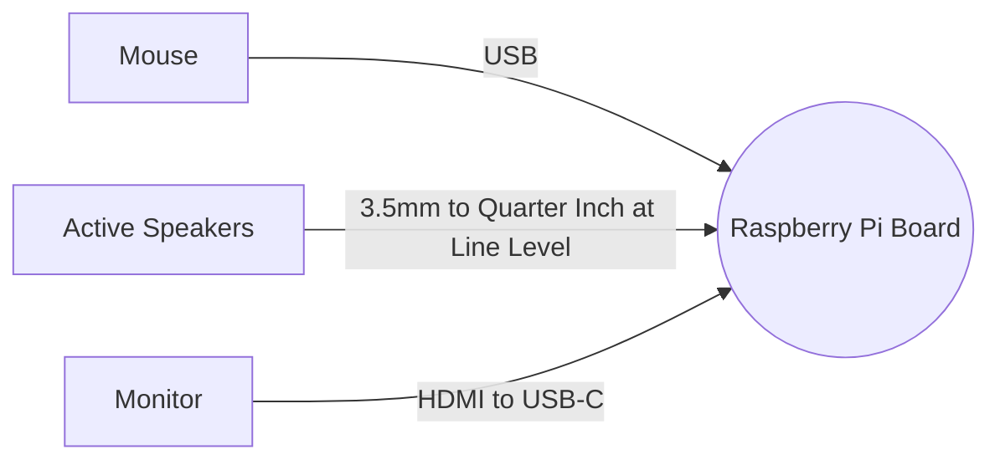
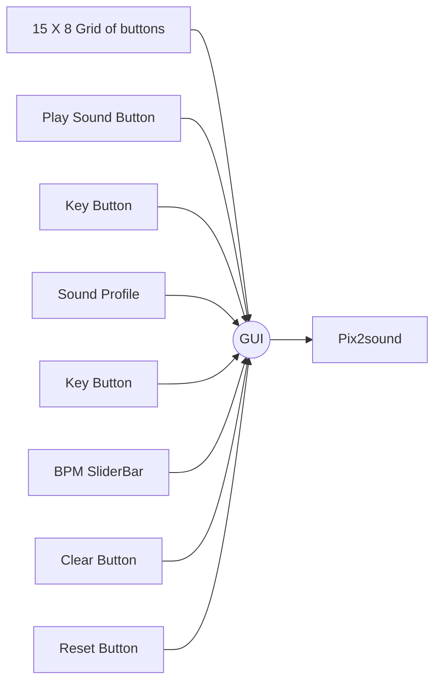

# POC Documentation Group D // Andy,Bryan

##	Table of content

1.	Equipment List
2.	Software list
3.	Using Tkinter for the GUI
4.	Install sound library and SoX(Sound Exchange)
5.	Setting up variables and list(Of list)
6.	Make a grid of buttons (15x8)
7.	Toggle buttons between 1 and 0 (With colour change)
8.	Dropdown & slider for notes, type and BPM selection
9. Play, clear and reset buttons
10. Explanation of functions above
11. Final GUI look

###	Equipment List	


###	Software List


### Using Tkinter for the GUI
First thing to do is to import Python GUI Tkinter module:
```python
from tkinter import *
```
>Note: (*) refers to all variables, methods, etc.
### Install sound library and SoX(Sound Exchange)
Install sound library [here](https://github.com/huats-club/sorpiart/blob/main/pix2music.py).

Import sound library module:
```python
from pix2music.py import *
```
>Note: Ensure file is in same folder directory as GUI.

Open Terminal.
Installation of SoX:
`sudo apt install sox`

Next, to create a window, along with title and size:
```python
main = Tk()  
main.title("Musical GUI")  
main.minsize(800, 980)
```
Add a loop at the end:
`main.mainloop()`
>To run application forever, as long as the window is not closed.
>>Note: The loop should always be placed at the **last** line!
### Setting up variables and list (of lists)
box and mainbox shall be used for **columns** and **rows** respectively:
```python
box = [i for i in range(8)] #list with 8 items
for i in range(8):  
    box[i] = 0  #every item in box = 0
mainbox = [j for j in range(15)]  #list with 15 items
for j in range(15):  
    mainbox[j] = box #every item in mainbox = box
```
Output for each line of code above if printed:
```python
Output:
[0,1,2,3,4,5,6,7]
-
[0,0,0,0,0,0,0,0]
[0,1,2,3,4,5,6,7,8,9,10,11,12,13,14]
-
[[0,0,0,0,0,0,0,0],[0,0,0,0,0,0,0,0],[0,0,0,0,0,0,0,0],
...]
```
>The mainbox contains 15 of box : "[0,0,0,0,0,0,0,0]" in its list.

### Make a grid of buttons (15x8)
Create 8 columns and 15 rows of buttons:
```python
for x in range(15):  # x represents rows
    for y in range(8):  # y  represents columns
        button = Button(main, text="{},{}".format(x, y),
        width=5, height=3, fg='black')  
        button.grid(row=x, column=y)
        #assign position of buttons^
        button.config(bg='white', highlightbackground=
        'white',command=lambda send_var=(x, y, button):
        func(send_var)
```
>Command to **toggle** buttons whenever clicked.
>>Also, a **grid** layout is mainly used in this GUI.

It should look like this:


### Toggle buttons between 1 and 0 (with colour change):
```python
def func(get_var):  
    button = get_var[2]  #get number of button clicked
    if mainbox[get_var[0]][get_var[1]] == 0: #change toggle status from 0 to 1
        mainbox[get_var[0]][get_var[1]] = 1  
  button.config(highlightbackground='green', #change button and text colour
  highlightthickness='0', fg='red', bg='green')  
    else:  
        mainbox[get_var[0]][get_var[1]] = 0  #change toggle status from 1 to 0
  button.config(highlightbackground='white',
  fg='black', bg='white')                        
```
- To toggle status from 0 to 1 or 1 to 0, the button status is obtained.
- What "mainbox[get_var[0]][get_var[1]]" does is to get row and column of mainbox, which leads to the button toggle status (default is 0).
### Dropdown & slider for notes, type and BPM selection
---
- Dropmenus, and set default values for profiles and keys.
- Store input in a variable for pix2music sound library later.
- OptionMenu's syntax: OptionMenu(master, variable,*values)
  - master is the window to place the widget in
  - variable means it is not fixed, types like String() and Int() can be implemented.
  - *values is the name of list to store all the options.
```python
profiles = ['pluck', 'sine', 'square', 'triangle', 'sawtooth', 'trapezium']  
profilesInsert = StringVar()  
profilesInsert.set("sine")  
profileDropdown = OptionMenu(main, profilesInsert, *profiles)  
profileDropdown.grid(rowspan=3, row=2, column=9)  
profileDropdown.config(width=9, height=2)  
key = ['C1', 'C2', 'C3', 'C4', 'C5', 'C6']  
keyInsert = StringVar()  
keyInsert.set("C4")  
keyDropdown = OptionMenu(main, keyInsert, *key)  
keyDropdown.grid(rowspan=3, row=3, column=9)  
keyDropdown.config(width=9, height=2)  
BPM = IntVar()  
BPM.set(60)  
BPMScale = Scale(main, variable=BPM, from_=60, to=180, orient=HORIZONTAL)  
BPMScale.grid(rowspan=3, row=4, column=9)  
BPMLabel = Label(main, text='BPM(60-180)')  
BPMLabel.grid(rowspan=2, row=5, column=9)
```
>The profiles, keys and BPM are to be stored in **variables** for implementation of sound library.
>>Both key and profile are **strings** type while BPM is suppose to be an **integer** type. Hence, the StringVar() and IntVar(). 

### Play, clear and reset buttons
A play button is needed to eventually send out **selected** buttons. Clear and reset buttons were also added.

This is how to do it:

```python
playbutton = Button(main, text="Play Sound", 
padx=20, pady=20, command=print_toggle).grid(rowspan=4, 
row=0, column=9)  
clearbutton = Button(main, text="Clear", padx=30, 
pady=10, command=clearbtn).grid(rowspan=3, row=6, 
column=9)  
resetbutton = Button(main, text="Reset", padx=30, 
pady=10, command=resetbtn).grid(rowspan=3, row=7, 
column=9)
```
Each button comes with their **separate** functions:
```python
def print_toggle():  
    print(keyInsert.get(), profilesInsert.get(), BPM.get())  
    print("TOGGLE(CURRENT):\n{}".format(mainbox))  
    pix2music(profilesInsert.get(), BPM.get(), keyInsert.get(), mainbox)  
    
def clearbtn():  
    for i in main.winfo_children():  #calling for every buttons in the GUI
        i.config(highlightbackground='white', fg='black', bg='white')  
    for j in range(15):  
        mainbox[j] = [box[i] for i in range(8)]  
    print("TOGGLE(CURRENT): \n{}".format(mainbox))  
  
def resetbtn():  
    profilesInsert.set("sine")  
    keyInsert.set("C4")  
    BPM.set(60)  
    clearbtn()
```
#### Explanation of functions above:
- print_toggle() sends selected profile, key, BPM and buttons to pix2music ; to play sound.
- clearbtn() clears selected buttons, turning them back to its original state (white background, 0).
- resetbtn() resets profile, key, BPM and buttons to its original state.

### Final GUI look


